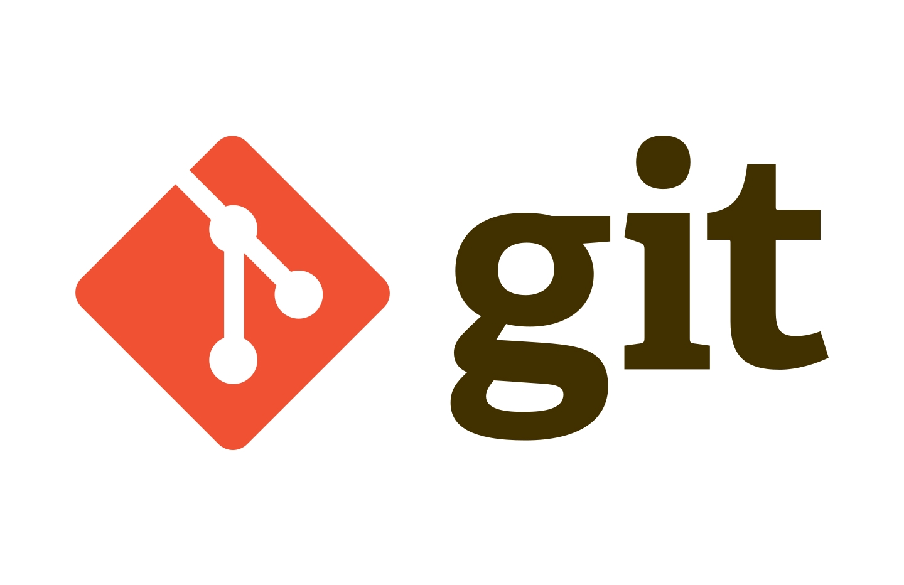

# Hi Guys 👋

### 🔭 **I know how to use** :
---

 

 

### 🌱 **Recently, i'm learning** : 
---

 

 

 

### 👯 **I'm interest in** :
---

 

 

### 🤔 **I need for help with** :
---

 

 

### 📫 **You can touch with me by** :
---
### email : *xorb269@naver.com*

<!--

Here are some ideas to get you started:

- 🔭 I’m currently working on ...
- 🌱 I’m currently learning ...
- 👯 I’m looking to collaborate on ...
- 🤔 I’m looking for help with ...
- 💬 Ask me about ...
- 📫 How to reach me: ...
- 😄 Pronouns: ...
- ⚡ Fun fact: ...
-->
